# WHD — Wireless Hardware Debugger

A browser-based, Linux-first debugging platform for PCIe and USB wireless adapters: discovery, bus/driver/firmware/PHY
inspection, live event correlation, mt76-specific instrumentation, bounded captures with replay and diagnostic
bundles, and an evidence-based diagnostic engine. **Read-only by default**; the web server never runs as root.

Developed and verified on Debian 13, kernel 7.2/7.3 (custom mt76 build), x86_64, with two MediaTek MT7927 PCIe adapters.
See *Verification status* below for exactly what was validated on hardware versus fixtures.

## Screenshots

All screenshots are **demo mode**: the hardware inventory is recorded from the development host (MAC addresses masked) and
the event/telemetry stream is a **synthetic, scripted incident** (an MCU command timeout followed by a chip reset and
re-association), not a measured failure. The orange banner is always visible in demo mode.

| | |
|---|---|
| 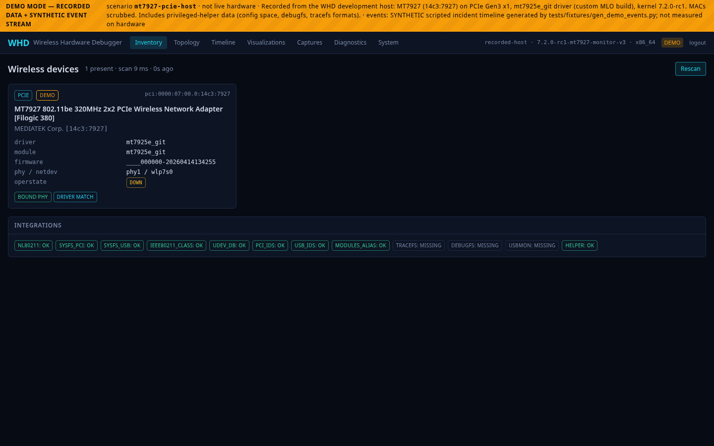 **Inventory** — discovered adapters, driver, firmware, PHY/netdev, detection reasons, integration status | 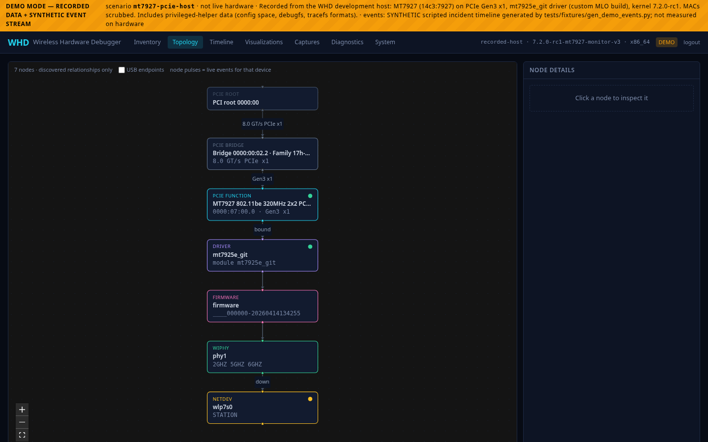 **Topology** — discovered PCIe path root → bridge → function → driver → firmware → PHY → netdev, with link state |
| 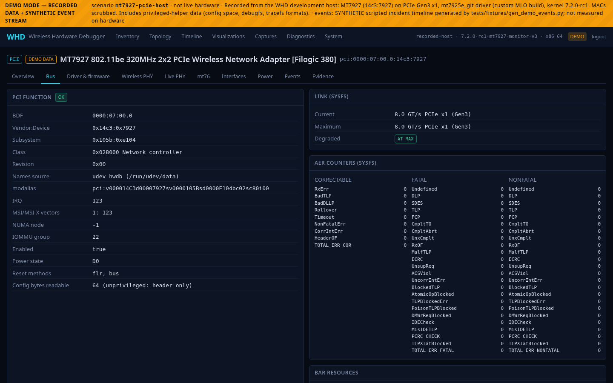 **PCIe inspector** — link, AER counters, BARs, decoded config space (via the helper) | 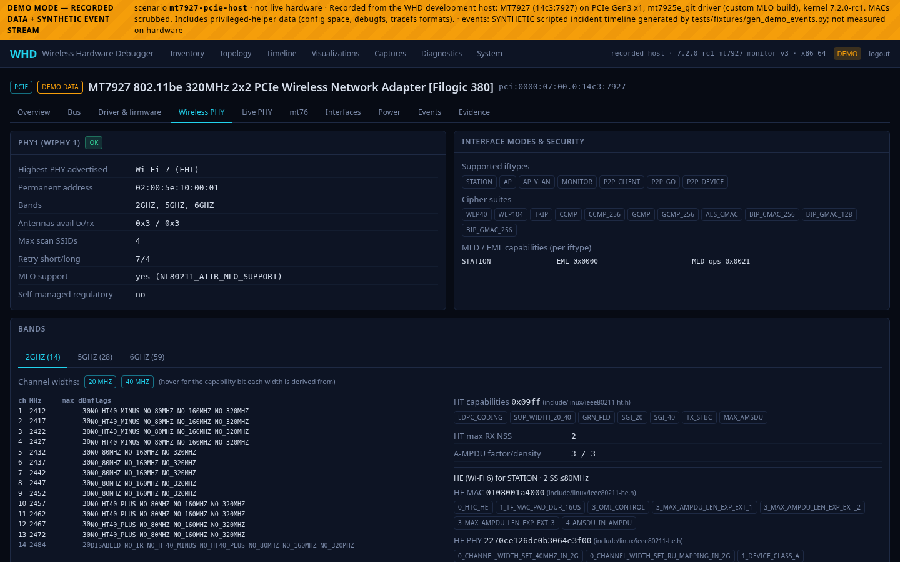 **Wireless PHY** — bands, widths and HT/VHT/HE/EHT capability bits decoded from nl80211 |
| 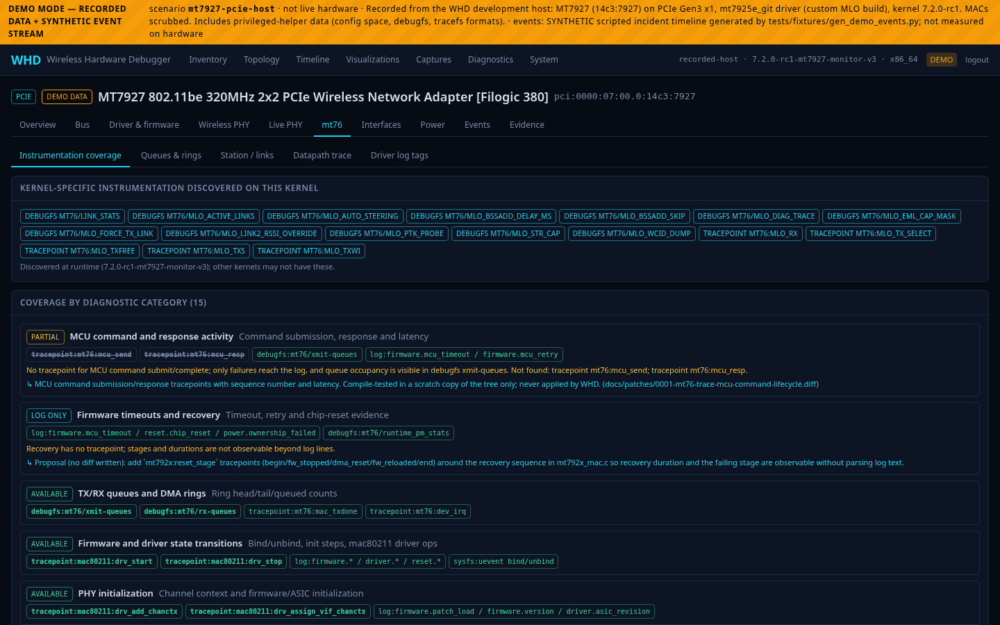 **mt76 module** — which instrumentation exists on this kernel, what is missing, patch proposals | 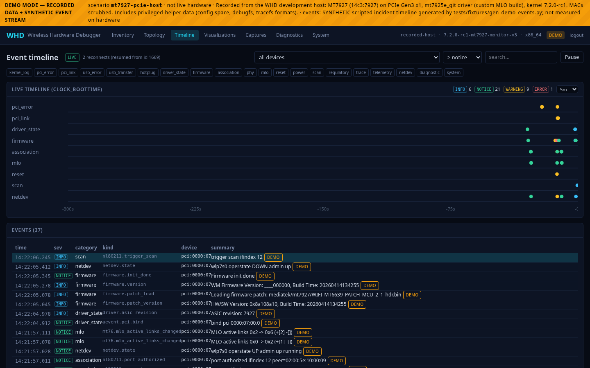 **Timeline** — correlated events with severity, source, device and raw evidence |
| 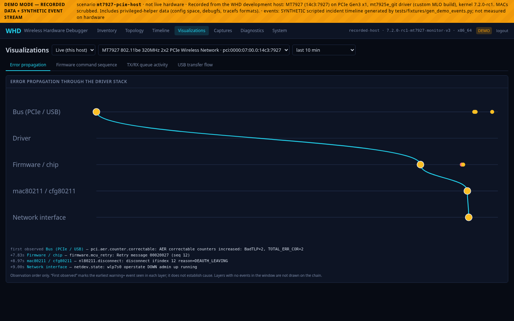 **Error propagation** — first warning+ event per driver-stack layer, in observed order | 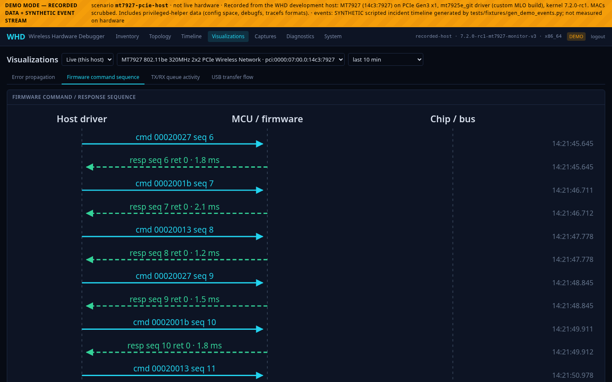 **Firmware command sequence** — host ↔ MCU ↔ chip |
| 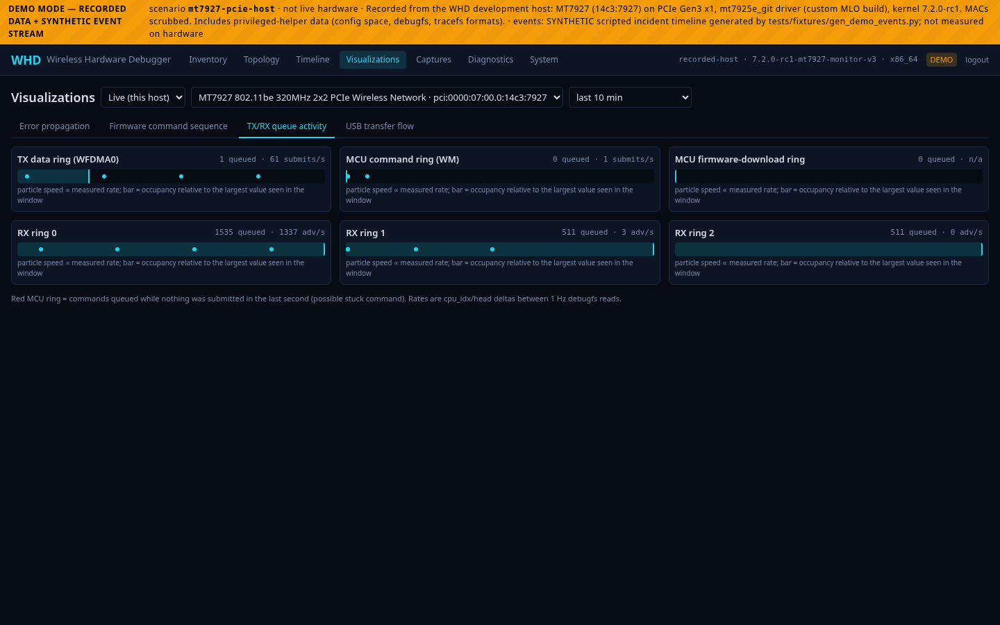 **TX/RX ring activity** from 1 Hz debugfs samples | 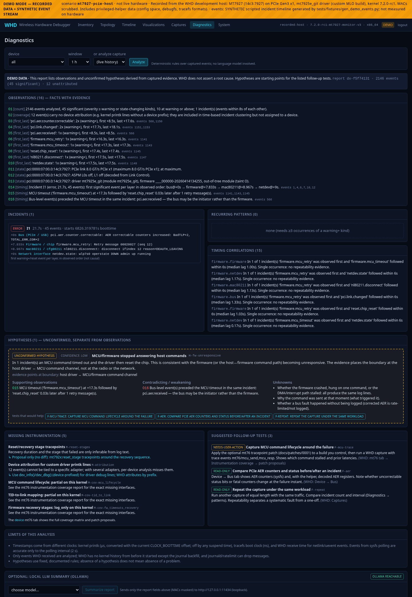 **Diagnostics** — observations, incidents, **unconfirmed** hypotheses, missing instrumentation, follow-up tests |
| 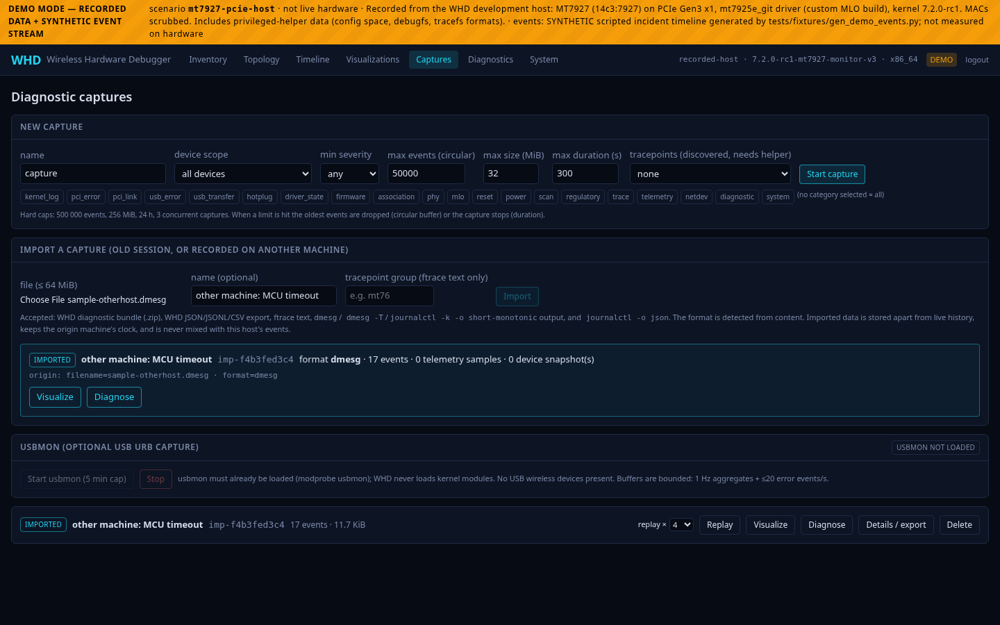 **Import** — a raw `dmesg` from another machine, format detected, warnings shown | 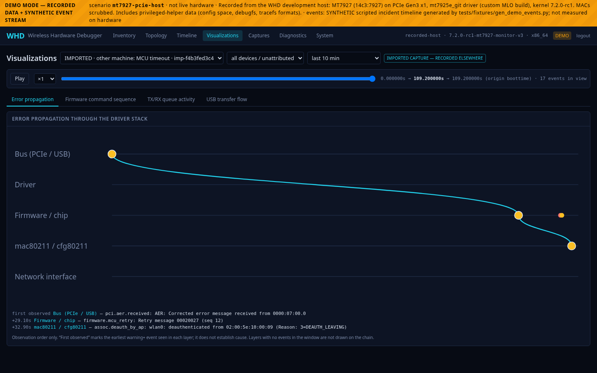 **Imported capture** — visualized with a playback cursor |
| 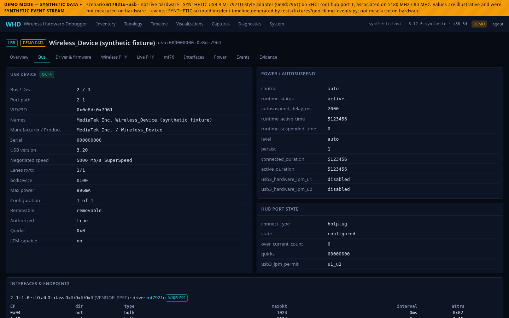 **USB inspector** (synthetic USB fixture) | 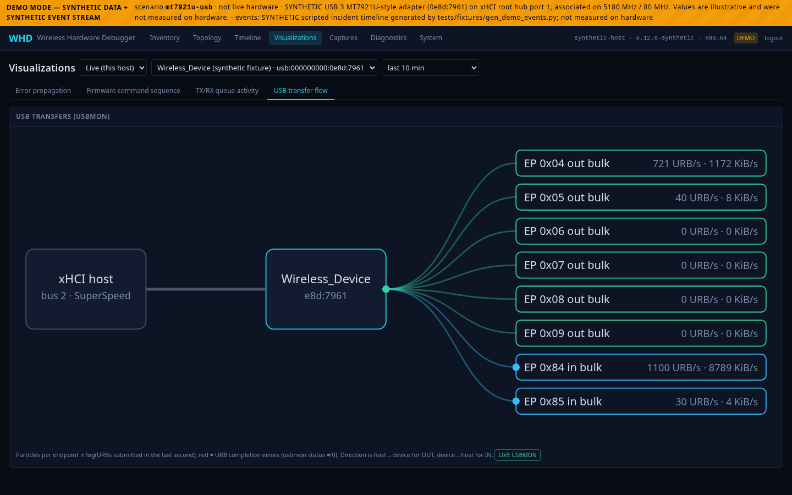 **USB transfer flow** from usbmon aggregates (synthetic) |
| 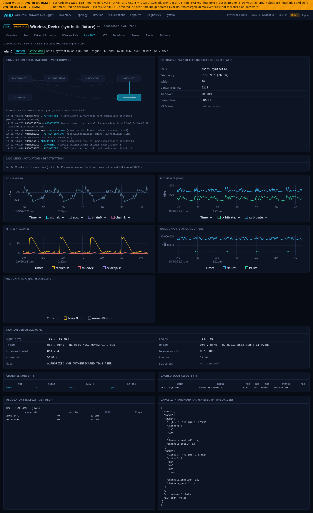 **Live PHY** — state machine, MLO links, signal/bitrate/retry charts (synthetic station data) | |

Regenerate them (demo servers on :8801 and :8802, see `frontend/e2e/shots.spec.ts`; the script refuses to save a page
containing non-synthetic MACs, private IPs, home paths or e-mail addresses):

```bash
WHD_DEMO_SPEED=3 WHD_STATE_DIR=/tmp/whd-a  uv run --project backend whd serve --demo mt7927-pcie-host --port 8801 &
WHD_DEMO_SPEED=3 WHD_STATE_DIR=/tmp/whd-b  uv run --project backend whd serve --demo mt7921u-usb --port 8802 &
cd frontend && WHD_TOKEN=$(cd ../backend && uv run whd token --show) WHD_SHOTS=../docs/screenshots \
  WHD_SAMPLE_DMESG=../docs/examples/sample-otherhost.dmesg WHD_URL=http://127.0.0.1:8801 \
  npx playwright test shots -g "pcie demo|capture import" --workers=1
WHD_TOKEN=... WHD_SHOTS=../docs/screenshots WHD_URL=http://127.0.0.1:8802 npx playwright test shots -g "usb demo"
```

## Examples you can try (no hardware needed)

| File | What it is |
|---|---|
| `docs/examples/sample-otherhost.dmesg` | A synthetic kernel log "from another machine". Import it on the Captures page, then **Visualize** / **Diagnose**. |
| `docs/examples/demo-incident-bundle.zip` | A real diagnostic bundle exported by WHD from demo mode (MACs masked, manifest with SHA-256 per file). Import it to see a bundle round-trip. |
| `docs/examples/demo-diagnostic-report.json` | The diagnostic report for that capture: observations, incident, correlations, the unconfirmed `H-fw-unresponsive` hypothesis with its unknowns, missing instrumentation and follow-up tests. |

## Quick start

```bash
make setup                 # uv sync (backend, Python ≥3.12) + npm ci (frontend)
make build                 # regenerate API types + production frontend build (served by the backend at /)
make helper                # (separate terminal, asks for sudo) privileged read-only helper
make serve                 # http://127.0.0.1:8787  (live hardware)
cd backend && uv run whd token --show   # access token for the login page
```

Try it without hardware: `make demo` (default scenario `mt7927-pcie-host`; others: `mt7921u-usb`, `renamed-netdev`,
`pci-no-driver`, `no-nl80211`, `empty`). Demo mode shows a striped **DEMO MODE** banner, writes to a separate database
(`whd-demo-<scenario>.db`) and its event stream is **synthetic** (a scripted incident). `WHD_DEMO_SPEED=4` speeds it up.

The helper is optional. Without it WHD still shows sysfs/nl80211/journal data; PCIe config space (ASPM/AER/MSI),
tracefs, debugfs and usbmon are reported as *requires privilege* rather than guessed.

### Importing captures from other machines / old sessions

Captures page → **Import a capture**. Accepted (detected from content): a WHD diagnostic bundle (`.zip`), WHD JSON/JSONL/CSV
exports, ftrace text, `dmesg` / `dmesg -T` / `journalctl -k -o short-monotonic` output, and `journalctl -o json`.
The import is stored apart from live history (never mixed into this host's events), keeps the origin machine's clock, and can be
**visualized** (time scrubber + playback; error propagation, firmware sequence, queue and USB views when the source has the data),
**diagnosed** (analyzed against the capture's own device inventory, not this host's), exported, bundled and replayed. Raw logs
have no inventory, so state-based observations and ring/queue views are limited. Limits: 64 MiB per file, 200 000 events, zip
member/size caps, per-field length caps; malformed lines are counted and reported. API: `POST /api/v1/captures/import`
(raw body, `filename`, optional `name`, `group_hint` for ftrace text).

### Remote access

Over SSH from another machine: `make serve-remote` binds to the address your SSH session arrived on and prints the URL
(or `make serve HOST=<address>`; `HOST=0.0.0.0` binds every interface). The token login still applies.

WHD binds `127.0.0.1` and refuses other addresses unless `WHD_ALLOW_REMOTE=1`. Do **not** expose it to the public
internet. Use an SSH tunnel (works from macOS/Windows/Linux):

```bash
ssh -L 8787:127.0.0.1:8787 user@host      # then browse http://127.0.0.1:8787
```

Authentication is a 256-bit token (`~/.config/whd/token`, mode 0600) exchanged for an HttpOnly, SameSite=Strict cookie
(HMAC-signed, survives restarts). Cookie-authenticated mutations also need an `X-WHD-Request: 1` header; CLI clients can
use `Authorization: Bearer <token>`. Logins are rate limited (10 failures / 5 min). Behind a TLS proxy set
`WHD_COOKIE_SECURE=1`.

## Development

```bash
make dev        # backend --reload + vite dev server (proxy /api), http://127.0.0.1:5173
make check      # ruff + eslint, mypy --strict + tsc, pytest + vitest
make test-live  # opt-in read-only tests against this host's real hardware
make e2e        # Playwright (needs a running server: WHD_URL, WHD_TOKEN; demo specs also WHD_DEMO=1)
make fixtures   # rebuild derived/synthetic fixtures and demo event streams
make consts     # regenerate kernel constants from /usr/src/linux-headers-$(uname -r)
```

Environment variables: `WHD_HOST`, `WHD_PORT`, `WHD_ALLOW_REMOTE`, `WHD_DEMO`, `WHD_DEMO_SPEED`, `WHD_STATE_DIR`,
`WHD_CONFIG_DIR`, `WHD_HELPER_SOCKET`, `WHD_OLLAMA_URL`, `WHD_OLLAMA_MODEL`, `WHD_ENABLE_DOCS` (API docs, off by default),
`WHD_COOKIE_SECURE`, `WHD_NO_EVENT_SOURCES`.

## Architecture

```
Browser ── HTTP/WebSocket ── whd-server (FastAPI, unprivileged)
                              ├─ platform/  sysfs (read-only, deny-listed names), raw netlink (nl80211 GET-only allowlist,
                              │             rtnetlink, uevent), ETHTOOL_GDRVINFO ioctl, modules.alias, hwdb/pci.ids
                              ├─ collectors/ + discovery  (PCI, USB, netdev, driver, power, PCIe config decode)
                              ├─ events/    sources → bus → SQLite (bounded queues, resume by id)
                              ├─ drivers/mt76  coverage report, debugfs parsers, trace aggregation
                              ├─ capture/   bounded sessions, export, bundles, replay
                              ├─ diagnostics/  rule engine + optional Ollama client
                              └─ unix socket ── whd-helper (root; fixed verbs, SO_PEERCRED allowlist)
                                                 pci_config_read · debugfs_list/read (tiered allowlist) · tracefs
                                                 (own instance `instances/whd`) · usbmon stream
```

Design spec: `docs/superpowers/specs/2026-10-09-whd-architecture-phase1-design.md` (see its *Implementation notes*).
Clock handling: `docs/clock-domains.md`. Optional kernel instrumentation proposals: `docs/patches/`.

### Safety model

* Never performed by WHD: device reset, driver unbind/bind, module (un)load, firmware changes, PCI config writes,
  regulatory/interface changes, packet injection, interface up/down, scans. There are no endpoints that do any of these.
* nl80211 access is an allowlist of GET commands (`platform/nl80211/source.py`); sysfs reads refuse
  `reset/remove/rescan/rom/resource*/driver_override/bind/unbind/...`.
* The helper writes only inside its own tracefs instance. debugfs files are read only if on a reviewed allowlist, with a
  side-effect tier: `passive` (memory only), `wakes_device` (takes the mt76 mutex and wakes the chip; needs explicit
  `wake=true`, audit-logged), `mmio`/`mcu` (need an explicit allow the UI does not offer), `never` (write-only action
  nodes such as `chip_reset`, and firmware-RAM dump nodes).
* Mutating API calls (start/stop trace, captures, replay, usbmon) are audit-logged (`audit` table).
* WHD does not modify `~/mt76` or any driver tree. Kernel patch *proposals* live in `docs/patches/` and are never applied.

## Implemented vs. not implemented

| Area | Status |
|---|---|
| Discovery (PCI/USB, bound PHY, modalias-matched unbound devices, stable IDs, firmware via ethtool, bands/widths/caps from nl80211 incl. HT/VHT/HE/EHT, MLO capability) | implemented |
| Topology (React Flow, discovered relationships only) with event pulses | implemented |
| PCIe: link, AER counters (sysfs) + decoded AER/ASPM/L1SS/MSI/MSI-X/PM/BARs (helper) | implemented |
| USB: descriptors, interfaces, endpoints, speed, power/autosuspend, hub port state; usbmon URB capture | implemented (usbmon: parser tested only, see below) |
| Live event streaming (journal, uevent, nl80211, rtnetlink, pollers, tracefs) + timeline, WebSocket resume, bounded queues | implemented |
| Wireless PHY live view (station, rates, per-link, survey, scan cache, regulatory, power save), charts, state machine, MLO links | implemented |
| mt76 module (coverage matrix, debugfs snapshot, queue polling, trace session, TID/link & per-link aggregation, patch proposal) | implemented |
| Captures (limits, JSON/JSONL/CSV/ftrace-text export, redacted `.zip` bundle), replay, import of foreign/old captures | implemented |
| Visualizations (topology, USB flow, queue activity, firmware sequence, state machine, MLO links, error propagation, timeline) | implemented |
| Diagnostic engine + optional Ollama summary | implemented |
| `perf`, eBPF/bpftool, `devlink` | **not used** (tools absent or not needed for the implemented features) |
| `trace.dat` (binary) export | **not implemented** (ftrace *text* only) |
| Monitor-mode diagnostics | observes existing monitor interfaces only; WHD never creates or reconfigures interfaces |
| Multi-user accounts / TLS termination | not implemented (single shared token; use a tunnel or a TLS proxy) |
| iwlwifi / ath11k / ath12k / Realtek extensions | generic discovery/PHY works; no driver-specific module (extension registry exists: `drivers/registry.py`) |
| macOS/Windows browsers | not tested (Chromium on Linux only) |

## Verification status

**Verified on real hardware** (2× MT7927 `14c3:7927`, PCIe Gen3 x1, `mt7925e_git`, kernel 7.2.0-rc1 and 7.3.0-rc5):
discovery and stable identity; sysfs/ethtool/nl80211 decoding (bands up to 320 MHz, EHT caps, MLO capability);
helper config-space decode (ASPM disabled, AER, L1SS, MSI) and debugfs tier policy; live journal/uevent/nl80211/rtnetlink/
poll sources and device attribution; an isolated tracefs session (instance created, 3k+ events streamed, instance removed);
mt76 coverage report and passive/wake debugfs snapshots; browser (Playwright/Chromium) tests of the UI against it; live
Ollama (`llama3.2:3b`) summary.

**Verified only with fixtures / synthetic data** (flagged DEMO in the UI): associated-station telemetry and MLO link activity
(no adapter was associated during live testing), MCU timeout/recovery sequences, PCIe error bursts and link retraining, all
USB behavior (no USB Wi-Fi adapter on the host; the `mt7921u-usb` fixture is synthetic), usbmon (module not loaded; WHD never
loads modules), TID-to-link aggregation from real tracepoints under traffic.

**Patch 0001** (mt76 MCU tracepoints) was compile-tested against the running kernel's headers in a scratch copy only; it
was never loaded. WHD reports `mcu_send/mcu_resp` as *missing* on this kernel.

## Known limitations

* sysfs-derived bus events are accurate only to the poll interval (2 s); see `docs/clock-domains.md`.
* Custom `MLO_*` printk lines have no device prefix, so they cannot be attributed to one of several adapters (reported as
  unattributed, not guessed).
* Untested under systemd: `deploy/systemd/*.service` are examples (syntax accepted by `systemd-analyze verify`; paths are
  placeholders).
* The negotiated TID-to-link mapping is not exposed by this driver; WHD shows the *observed* TX link per TID instead.
